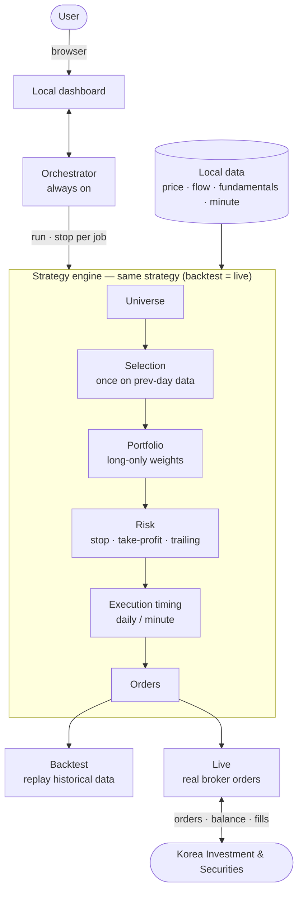

<div align="center">

# buylow

**A personal toolkit to build Korean-equity (KOSPI·KOSDAQ) automated trading strategies without code, backtest them on historical data, and run them live.**

Built on the [QuantConnect LEAN](https://github.com/QuantConnect/Lean) engine, where **the same strategy definition runs unchanged in both backtest and live trading**. All data and API keys stay on your own machine.

[한국어](./README.md) · **English** · [日本語](./README.ja.md)

</div>

---

## Table of contents

1. [Overview](#overview)
2. [Features](#features)
3. [Supported brokers](#supported-brokers)
4. [Dashboard](#dashboard)
5. [Architecture and pipeline](#architecture-and-pipeline)
6. [Setup](#setup)
7. [Disclaimer](#disclaimer)
8. [License](#license)

---

## Overview

buylow handles Korean-equity automated trading through a **local web dashboard** that runs only on your PC. After installing, you use it **through the browser dashboard**.

- Define strategies with **signal combination rules + risk settings** — no coding.
- Backtest against **whole-market Korean data** and review results as a Korean-language summary plus a trade log.
- Run the same strategy live on **Korea Investment & Securities (KIS)** (backtest = live isomorphism).
- All data and API keys are stored locally only and are never sent anywhere.

---

## Features

### Signals (alpha) — 7 of them

Each signal judges, per ticker per trading day, whether conditions are **buy-favorable / sell-favorable / neutral**. Parameters are tuned on the Strategy tab.

| Signal | Type | Description | Key parameters |
|---|---|---|---|
| EMA | Trend | Buy-favorable when the short MA is above the long MA, sell-favorable when below | Short / long periods |
| MACD | Trend·Momentum | Buy-favorable when the MACD line is above the signal line | Fast / slow / signal |
| RSI | Overbought·Mean-reversion | Buy-favorable when oversold, sell-favorable when overbought | Period / oversold / overbought |
| Momentum | Trend | Buy-favorable when the last N-day return is positive | Lookback period |
| Bollinger Bands | Mean-reversion·Breakout | Mean-reversion on band touch; switches to trend-following on a strong breakout | Period / std multiplier / switch threshold (%) |
| Value | Fundamental | Buy-favorable when low PER·low PBR and ROE (= PBR/PER) is above a floor (avoids value traps) | PER·PBR caps / ROE / dividend floor |
| Flow (supply-demand) | Korea-specific | Buy-favorable when the recent N-day cumulative net buying by foreigners/institutions/individuals (selectable) is positive | Cumulative days / investor selection |

Value and flow signals require fundamental and flow data to be loaded (see *Data management* below).

### Buy rules

Signals are combined into a boolean rule. Conditions within a group must all hold (**AND**), and groups are OR'd together (**OR**), to trigger a buy. You also set a **signal-hold period** (how many extra days to hold after the buy signal disappears). Only one strategy is stored (single strategy).

You build the concrete rule on the **Strategy tab of the dashboard** (condition-group builder) — see [Dashboard](#dashboard) below.

### Risk management

The strategy decides buys; sells are decided by signal changes and the risk rules below (leave a field blank to disable it).

- **Per-security stop-loss (%)** — sell when the price drops N% from the buy price
- **Per-security take-profit (%)** — sell when unrealized gain reaches N%
- **Trailing stop (%)** — sell when the price drops N% from the post-buy high
- **Long-only (no shorting)** and a **concurrent-holdings cap** (when exceeded, hold only the most liquid names) apply by default.

### Execution timing (two-layer design)

The strategy runs in two layers, and **the same code executes identically in backtest and live**.

- **① Selection** — picks buy/sell candidates **once a day, always from the previous day's close** (no intraday re-selection → prevents overtrading).
- **② Execution timing** — decides only *when* to fill those candidates. The chosen timing automatically determines the data resolution.

| Timing | Resolution | Behavior |
|---|---|---|
| Open | Daily | Fill at the **open** of the next trading day |
| Close | Daily | Fill at the **close** (MarketOnClose) of the next trading day |
| Time-of-day | Minute | Fill the full quantity at a specified time |
| TWAP | Minute | Split the regular session (390 min) into N slices and fill the quantity across them (reduces market impact) |
| Pullback | Minute | Enter on a dip from a reference price / exit on a rebound |

- **Risk is also evaluated once a day at the close** (same philosophy as selection). Per-minute stop-losses were dropped because intraday noise caused overtrading; the close handles the liquidation *decision*, while the timing above handles the *fill*.
- Tickers/days without minute data **fall back to the open automatically**.
- ⚠️ Due to a LEAN data-feed limit, minute backtests are accurate only up to a scale of **tickers × trading days ≲ 10,000** (blocked beforehand if exceeded). Daily and live are unaffected.

### Backtest

- Period selection (date picker + quick buttons for 1 week / 1 month / 3 months / 6 months / 1 year); initial capital fixed at ₩100M.
- Universe: search by name/code, bulk-add an index (KOSPI200·KOSDAQ150), all tickers, or your own index (groups).
- Background execution + progress/logs, run history retained (SQLite, per-row/bulk delete).
- Results = a Korean-language summary (total return, final equity, max drawdown, win rate, Sharpe, etc.) + a trade log (date, ticker, buy/sell, quantity, amount, reason). Large trade logs (tens of thousands of rows) are shown with pagination.

### Data management

All data is managed on the **Data tab of the dashboard**.

- One **Update data** click incrementally loads price (OHLCV), flow (net buying by investor type), and fundamentals (PER/PBR) for all tickers (5-year backfill when empty).
- **Auto-load scheduler** (on by default) — incrementally loads daily bars on a fixed interval while the server runs. If you designate minute-bar targets, it loads those too.
- **Minute loading** — pick tickers/indexes and store minute bars (already-loaded days are skipped). KIS keeps minute bars for **about 1 year at most**.
- **Load status** — search by name/code, filter by index, view per-ticker detail (price·flow).
- **My index (custom ticker group)** — group tickers you want on the Groups tab, then use them across backtest / minute loading / load status with one click as `★name`, just like KOSPI200.

### Live trading (KIS)

- Turn on automated trading on the **Trade tab** and it places real orders using your saved strategy + target tickers (turn it off to stop).
- Buys follow the strategy and timing; exits follow signals/risk — the same code as backtest.
- **Account monitoring** — deposit / buyable amount / holdings (buy price / current price / P&L), market-open/close status, trade history (based on KIS execution inquiry, auto-refreshed every 10 seconds).
- **Today's selection** — previews which tickers would be bought/sold based on the saved strategy, target tickers, and current holdings (reproduces the once-a-day previous-close selection exactly).
- Automated trading is **off** by default; once on, it places orders immediately per the saved strategy. For the full live procedure see [docs/LIVE_KIS.md](./docs/LIVE_KIS.md).
- ⚠️ **Live requires building the KIS adapter DLL once** (not needed for backtest, hence optional in the install steps). If you flip the toggle without building it, you'll see a *"KIS adapter is missing"* notice — run the adapter-build step in [Setup](#setup) above.

---

## Supported brokers

| Broker | Data (quotes·minute) | Backtest | Live trading | Status |
|---|:---:|:---:|:---:|---|
| **Korea Investment & Securities (KIS live)** | ✅ | ✅ | ✅ | Working |
| **Korea Investment & Securities (KIS paper)** | ✅ | ✅ | ✅ (paper server) | Working — recommended for pre-live validation |
| **Toss Securities** | — | — | — | 🚧 Planned (awaiting Toss API release) |

- KIS keeps **live and paper app keys/accounts fully separate**, so each is registered and managed independently (same logic, different environment).
- Trading (balance·orders) uses the chosen broker's server, but **quote/minute loading always uses the live domain even if you chose paper** (account-free queries, which are more stable).
- Daily historical data comes from the auth-free pykrx, so it is independent of broker choice.

---

## Dashboard

| Tab | Contents |
|---|---|
| **Strategy** (default) | Signal parameters, buy rules (condition groups), risk, execution timing |
| **Backtest** | Run after choosing period·universe; results·trade log |
| **Data** | Update data, load status·search·index filter, minute loading, auto-scheduler status |
| **Groups** | Create·edit·delete your indexes (custom ticker groups) |
| **Settings** | Broker selection, KRX·broker API key entry (stored locally) |
| **Jobs** | Background-job progress·logs·run history |
| **● Trade** | Live account monitoring + automated trading on/off + target tickers + today's selection |

---

## Architecture and pipeline

An always-on **orchestrator** receives your requests (backtest·live) and **runs the strategy engine per job**, managing it. All processing and data happen on your PC, and the same strategy flows identically through backtest and live.



**Core design**

- **Write a strategy once and it applies identically to backtest and live** (isomorphism).
- Selection (what to buy/sell that day) runs once a day on the previous day's data; execution follows the chosen timing — two separated layers.
- The strategy decides buys; signal changes and risk decide sells.
- All data, settings, and history are stored only on the user's PC.

---

## Setup

### Install

You need — **.NET 10 SDK** (runs the engine), **Python 3.11** (runs strategies), **uv** (Python env), and **git**.

<details open>
<summary><b>macOS</b></summary>

```bash
# 1) .NET 10 SDK (add the export to ~/.zshrc to make it permanent)
curl -fsSL https://dot.net/v1/dotnet-install.sh | bash -s -- --channel 10.0 --install-dir "$HOME/.dotnet"
export DOTNET_ROOT="$HOME/.dotnet" && export PATH="$HOME/.dotnet:$PATH"

# 2) Python 3.11 · git · uv
brew install python@3.11 git
curl -LsSf https://astral.sh/uv/install.sh | sh

# 3) Code + dependencies
git clone https://github.com/JeongSeongMok/buylow.git
cd buylow
uv venv .venv && uv pip install --python .venv/bin/python -e ".[dev]"

# 4) Run the dashboard (default port 8420)
.venv/bin/python -m orchestrator.api
# To use a different port:  BUYLOW_DASHBOARD_PORT=9000 .venv/bin/python -m orchestrator.api

# 5) (For live trading — skip if you only backtest) Build the KIS adapter
dotnet build launcher/BuylowLauncher.csproj -c Release   # build the launcher first (restores NuGet)
scripts/build-adapter.sh                                  # build the adapter + copy the DLL next to the launcher
```

</details>

<details>
<summary><b>Windows (PowerShell)</b></summary>

```powershell
# 1) .NET 10 SDK · Python 3.11 · git · uv (open a new terminal after installing so PATH updates)
winget install Microsoft.DotNet.SDK.10
winget install Python.Python.3.11
winget install Git.Git
powershell -c "irm https://astral.sh/uv/install.ps1 | iex"

# 2) Code + dependencies
git clone https://github.com/JeongSeongMok/buylow.git
cd buylow
uv venv .venv
uv pip install --python .venv\Scripts\python.exe -e ".[dev]"

# 3) Run the dashboard (default port 8420)
.venv\Scripts\python -m orchestrator.api
# To use a different port:  $env:BUYLOW_DASHBOARD_PORT=9000; .venv\Scripts\python -m orchestrator.api

# 4) (For live trading — skip if you only backtest) Build the KIS adapter
#    build-adapter.sh is bash-only, so on Windows build the same way with the PowerShell commands below.
dotnet build launcher\BuylowLauncher.csproj -c Release             # build the launcher first (restores NuGet)
dotnet build adapter\MyTrading.Kis\MyTrading.Kis.csproj -c Release # build the adapter
Copy-Item adapter\MyTrading.Kis\bin\Release\net10.0\MyTrading.Kis.dll launcher\bin\Release\net10.0\
```

> ⚠️ **If `uv venv .venv` errors with "uv is not recognized as a cmdlet…" right after installing `uv`**, PATH
> hasn't refreshed yet. **Close the PowerShell window completely and open a new one**, then rerun. To use it
> in the current window without reopening, add it to PATH: `$env:Path = "$env:USERPROFILE\.local\bin;$env:Path"`.
> (The `.NET`/`python` commands also need a new terminal after install for the same reason.)

</details>

After launching, open the dashboard in your browser (default `http://127.0.0.1:8420`, or the port you set above).

### Key setup

Keys are entered and managed on the **Settings tab of the dashboard** (stored locally only).

- **KRX ID·password** — for flow·fundamental data ([free signup](https://data.krx.co.kr)). Not needed if you use price only.
- **Broker (KIS) keys** — on the Settings tab, choose the broker (live/paper) and enter the App Key·App Secret·account number·HTS ID (separate for live/paper; the HTS ID is needed for live fill notifications).

---

## Disclaimer

This software is provided for educational purposes. Automated trading carries significant financial risk, and you bear sole responsibility for any use. The authors are not liable for any financial loss. When using it, you must comply with your broker's API terms and all applicable laws and regulations. Backtest results are estimates based on historical data and do not guarantee future returns. In particular, live automated trading sends real orders the instant you flip the toggle, so be sure to validate thoroughly on a paper account and start with a small amount.

---

## License

[MIT License](./LICENSE) © buylow contributors
