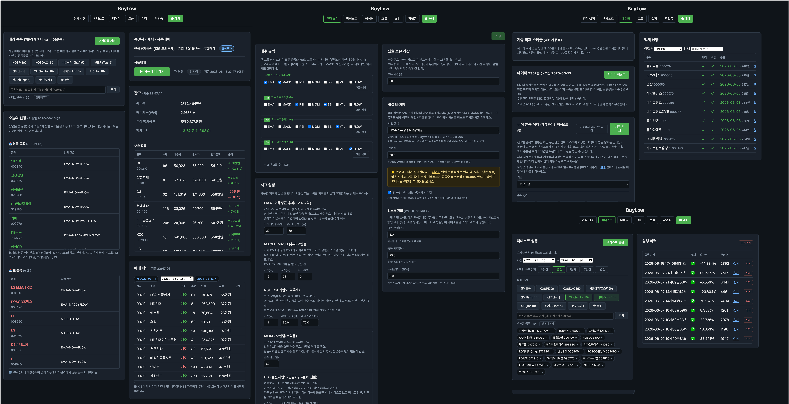
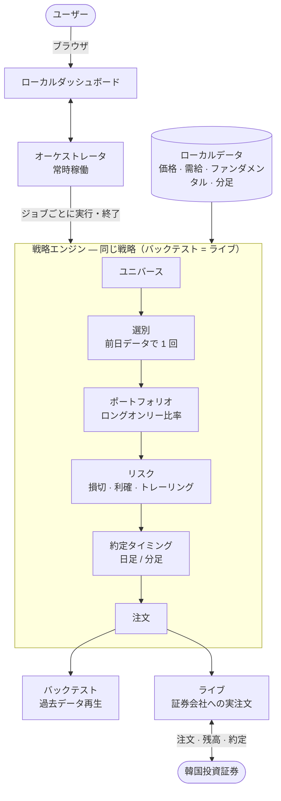

<div align="center">

# buylow



**韓国株式（KOSPI・KOSDAQ）の自動売買戦略をコードなしで構築し、過去データでバックテストし、実取引まで動かす個人向けツールキット。**

[QuantConnect LEAN](https://github.com/QuantConnect/Lean) エンジン上で動作し、**同一の戦略定義がバックテストと実取引でそのまま実行**されます。すべてのデータと API キーは自分の PC にのみ保存されます。

[한국어](./README.md) · [English](./README.en.md) · **日本語**

[](https://github.com/JeongSeongMok/buylow/releases)
[](./LICENSE)
[](https://github.com/JeongSeongMok/buylow/stargazers)


<sub>韓国株 自動売買 · 自動トレーディングボット · バックテスト · 韓国投資証券（KIS）API · LEAN · KOSPI · KOSDAQ · pykrx</sub>

<!-- デモ用スクリーンショット/GIF 枠: docs/assets/demo.png（または .gif）を追加後、下の行のコメントを解除

-->

</div>

---

## 目次

1. [概要](#概要)
2. [機能](#機能)
3. [対応証券会社](#対応証券会社)
4. [ダッシュボード](#ダッシュボード)
5. [アーキテクチャとパイプライン](#アーキテクチャとパイプライン)
6. [セットアップ](#セットアップ)
7. [免責事項](#免責事項)
8. [ライセンス](#ライセンス)

---

## 概要

buylow は自分の PC でのみ動作する**ローカル Web ダッシュボード**で韓国株式の自動売買を扱います。インストール後は**ブラウザのダッシュボードを通じて**利用します。

- コードを書かずに、**シグナル（指標）組み合わせルール + リスク設定**で戦略を定義します。
- 韓国市場の**全銘柄データ**でバックテストし、結果を韓国語のサマリーと取引履歴で確認します。
- 同じ戦略を**韓国投資証券（KIS）の実取引**でそのまま動かします（バックテスト＝ライブの同型性）。
- データと API キーはすべてローカルにのみ保存され、外部へは送信されません。

---

## 機能

### シグナル（アルファ）— 7 種

各シグナルは取引日ごとに銘柄単位で、**買い優勢 / 売り優勢 / 中立**を判定します。パラメータは戦略設定タブで調整します。

| シグナル | 種別 | 説明 | 主なパラメータ |
|---|---|---|---|
| EMA | トレンド | 短期移動平均が長期移動平均より上なら買い優勢、下なら売り優勢 | 短期・長期の期間 |
| MACD | トレンド・モメンタム | MACD ラインがシグナルラインより上なら買い優勢 | 短期・長期・シグナル |
| RSI | 過熱・逆張り | 売られすぎなら買い優勢、買われすぎなら売り優勢 | 期間・売られすぎ・買われすぎ |
| モメンタム | トレンド | 直近 N 日のリターンがプラスなら買い優勢 | 観測期間 |
| ボリンジャーバンド | 平均回帰・ブレイクアウト | バンドタッチ時は平均回帰、強くブレイクすればトレンド追随へ切替 | 期間・標準偏差倍率・切替しきい値（%） |
| 割安（バリュー） | ファンダメンタル | 低 PER・低 PBR かつ ROE（= PBR/PER）が基準以上なら買い優勢（バリュートラップ回避） | PER・PBR 上限・ROE・配当下限 |
| 需給追随 | 韓国市場特化 | 外国人・機関・個人（選択）の直近 N 日累積純買いがプラスなら買い優勢 | 累積日数・投資主体の選択 |

バリュー・需給シグナルは、ファンダメンタル・需給データが読み込まれていないと動作しません（下記 *データ管理* 参照）。

### 買いルール

シグナルをブール論理ルールで組み合わせます。1 つのグループ内の条件はすべて満たし（**AND**）、グループ同士はいずれか 1 つを満たせば（**OR**）買います。また**シグナル保有期間**（買いシグナルが消えた後に何日追加で保有するか）も指定します。戦略は 1 つだけ保存されます（単一戦略）。

具体的なルールの構成は、**ダッシュボードの戦略設定タブ**（条件グループビルダー）で行います — 下記 [ダッシュボード](#ダッシュボード) 参照。

### リスク管理

買いは戦略が、売りはシグナルの変化と下記のリスクが決定します（項目を空にすると無効）。

- **銘柄ストップロス（%）** — 買値より N% 下落したら売り
- **銘柄テイクプロフィット（%）** — 評価益が N% に達したら売り
- **トレーリングストップ（%）** — 買い後の高値から N% 下落したら売り
- **ロングオンリー（空売り禁止）**および**同時保有銘柄上限**（超過時は流動性上位のみ保有）がデフォルトで適用されます。

### 約定タイミング（2 層構造）

戦略は 2 層で動作し、**同じコードがバックテストとライブで同一に**実行されます。

- **① 選別** — **常に前日の終値データで 1 日 1 回**、買い/売り対象を選びます（ザラ場中の再選別なし → 過剰取引を防止）。
- **② 約定タイミング** — その対象を*いつ*約定するかだけを選びます。選んだタイミングがデータ解像度を自動的に決定します。

| タイミング | 解像度 | 動作 |
|---|---|---|
| 始値 | 日足 | 翌取引日の**始値**で約定 |
| 終値 | 日足 | 翌取引日の**終値**（MarketOnClose）で約定 |
| 指定時刻 | 分足 | 指定した時刻に全量約定 |
| TWAP | 分足 | 通常立会（390 分）を N 等分して数量を分割約定（マーケットインパクト緩和） |
| 押し目 | 分足 | 基準値より押したら参入 / 反発したら手仕舞い |

- **リスク評価も終値基準で 1 日 1 回**です（選別と同じ思想）。分足での毎分ストップロスはザラ場ノイズで過剰取引を招くため廃止し、手仕舞いの「判断」は終値で、「約定」は上記タイミングが処理します。
- 分足がない銘柄/日付は**始値へ自動フォールバック**します。
- ⚠️ 分足バックテストは LEAN のデータフィードの制約により、**銘柄数 × 取引日 ≲ 10,000** 規模までしか正確ではありません（超過時は事前にブロック）。日足・ライブは無関係です。

### バックテスト

- 期間選択（日付ピッカー + 1 週・1 か月・3 か月・6 か月・1 年のクイックボタン）、初期資金 1 億ウォン固定。
- ユニバース：銘柄名・コード検索、インデックス一括追加（KOSPI200・KOSDAQ150）、全銘柄、マイインデックス（グループ）。
- バックグラウンド実行 + 進捗・ログ、実行履歴の保管（SQLite、行単位/全体の削除）。
- 結果 = 韓国語サマリー（総リターン・最終資産・最大ドローダウン・勝率・シャープなど）+ 取引履歴（日付・銘柄・買い/売り・数量・金額・理由）。大量（数万件）の取引もページネーションで表示。

### データ管理

データはすべて**ダッシュボードのデータタブ**で管理します。

- **データ更新**を 1 回押すだけで、全銘柄の価格（OHLCV）・需給（投資主体別純買い）・ファンダメンタル（PER/PBR）を増分読み込み（空なら直近 5 年をバックフィル）。
- **自動読み込みスケジューラ**（デフォルト ON）— サーバー稼働中に一定周期で日足を増分読み込み。分足の対象銘柄を指定すれば併せて取得します。
- **分足読み込み** — 銘柄/インデックスを選んで分足を保存（取得済みの日はスキップ）。KIS は分足を**最大で約 1 年**保持します。
- **読み込み状況** — 銘柄名・コード検索、インデックスフィルタ、銘柄詳細（価格・需給）の照会。
- **マイインデックス（カスタム銘柄グループ）** — グループタブで好きな銘柄をまとめておくと、バックテスト・分足読み込み・読み込み状況で KOSPI200 のように `★名前` でまとめて使えます。

### ライブ取引（KIS）

- **取引タブ**で自動売買を ON にすると、保存した戦略 + 対象銘柄で実際の注文を出します（OFF で停止）。
- 買いは戦略・タイミング通りに、手仕舞いはシグナル/リスク通りに — バックテストと同じコード。
- **口座モニタリング** — 預り金・買付可能額・保有銘柄（買値/現在値/損益）、ザラ場/引け後の状態、取引履歴（KIS の約定照会ベース、10 秒ごとに自動更新）。
- **本日の選定** — 保存戦略・対象銘柄・現在の保有に基づき、組み入れる/外す銘柄を事前表示します（前日終値 1 回の選別をそのまま再現）。
- 自動売買はデフォルトで **OFF** で、ON にすると保存した戦略通りに即座に注文を出します。詳しいライブ手順は [docs/LIVE_KIS.md](./docs/LIVE_KIS.md) を参照。
- **運用面の堅牢性** — 自動売買を ON にしている間は、サーバーが再起動しても（デプロイ・再起動）自動的に再開し、ライブプロセスが予期せず終了しても短いバックオフの後に自動で再始動します。寄り付きなどで注文が集中する場合も、証券会社の秒間注文上限に合わせて送信ペースを調整し一時的なエラーは再試行するため、1 件の注文失敗が自動売買全体を止めることはありません。
- ⚠️ **ライブには KIS アダプタ DLL のビルドが一度必要です**（Docker インストールはイメージに同梱され自動。直接インストールはバックテストには不要なため任意）。ビルドせずにトグルを ON にすると *「KIS アダプタがありません」* という案内が出ます — 上記 [セットアップ](#セットアップ) のアダプタビルド手順を実行してください。

---

## 対応証券会社

| 証券会社 | データ（相場・分足） | バックテスト | ライブ実取引 | 状態 |
|---|:---:|:---:|:---:|---|
| **韓国投資証券（KIS 実取引）** | ✅ | ✅ | ✅ | 動作 |
| **韓国投資証券（KIS 模擬投資）** | ✅ | ✅ | ✅（模擬サーバー） | 動作 — 実取引前の検証用に推奨 |
| **トス証券** | — | — | — | 🚧 実装予定（Toss API 公開待ち） |

- KIS は**実取引と模擬投資のアプリキー・口座が完全に分離**されており、それぞれ個別に登録・管理します（同じロジック、環境のみ異なる）。
- 売買（残高・注文）は選んだ証券会社のサーバーを使い、**相場・分足の読み込みは模擬を選んでも常に実取引ドメイン**から取得します（口座不要の照会で安定的）。
- 日足の過去データは認証不要の pykrx で取得するため、証券会社の選択とは無関係です。

---

## ダッシュボード

| タブ | 内容 |
|---|---|
| **戦略設定**（デフォルト） | シグナルのパラメータ、買いルール（条件グループ）、リスク、約定タイミング |
| **バックテスト** | 期間・ユニバースを選んで実行、結果・取引履歴 |
| **データ** | データ更新、読み込み状況・検索・インデックスフィルタ、分足読み込み、自動スケジューラの状態 |
| **グループ** | マイインデックス（カスタム銘柄グループ）の作成・編集・削除 |
| **設定** | 証券会社の選択、KRX・証券会社 API キーの入力（ローカル保存） |
| **実行中** | バックグラウンドジョブの進捗・ログ・実行履歴 |
| **● 取引** | ライブ口座モニタリング + 自動売買 on/off + 対象銘柄 + 本日の選定 |

各タブの実際の画面は **[ダッシュボードのスクリーンショット集 →](./SCREENSHOTS.md)** で確認できます（キャプションは韓国語 — UI が韓国語のため）。

---

## アーキテクチャとパイプライン

常時稼働する**オーケストレータ**がユーザーのリクエスト（バックテスト・ライブ）を受け取り、**ジョブごとに戦略エンジンを実行**して管理します。すべての処理・データは自分の PC で行われ、同じ戦略がバックテストとライブに同一に流れます。



**コア設計**

- **戦略を一度書けば、バックテストとライブに同一に適用**されます（同型性）。
- 選別（その日に組み入れる/外す銘柄）は前日データで 1 日 1 回、約定は選んだタイミング通りに — 2 層に分離されています。
- 買いは戦略が、売りはシグナルの変化とリスクが決定します。
- すべてのデータ・設定・履歴はユーザーの PC にのみ保存されます。

---

## セットアップ

### インストール

インストール方法は 2 通りです — **Docker**（最も簡単・全 OS）または**直接インストール**（Linux · macOS）。
どちらもバックテストとライブを一度に揃えます。**Windows ユーザーは Docker を推奨**します（直接インストールは
.NET/Python ランタイムを OS ごとに手で合わせる必要があり煩雑です）。

<details open>
<summary><b>① Docker（推奨 — 全 OS）</b></summary>

[Docker](https://docs.docker.com/get-docker/) さえあれば動きます（.NET・Python・LEAN はすべてイメージに同梱）。

```bash
git clone https://github.com/JeongSeongMok/buylow.git
cd buylow

# ビルド + バックグラウンド起動（初回ビルドは .NET SDK・NuGet の取得で数分かかります）
docker compose up -d --build
# 別のポートで開くには:  BUYLOW_PORT=9000 docker compose up -d --build

# ログ表示 / 停止
docker compose logs -f
docker compose down
```

- データ・結果・設定はホストのディレクトリ（`data/`・`runs/`・`state/`）に保存されるため、コンテナを
  削除しても**保持**されます — 設定（`config.local.yaml`）・実行履歴（`buylow.db`）・KIS トークンは `state/` にまとまります。
- API キーはダッシュボードの**設定**タブで入力し、`state/config.local.yaml` に保存されます。
- ダッシュボードはホストの `127.0.0.1` にのみマッピングされるため**ローカル専用**です（外部ネットワークへの公開なし）。
- ライブ用の KIS アダプタ DLL はイメージに含まれています。

</details>

<details>
<summary><b>② 直接インストール（Linux · macOS）</b></summary>

**.NET 10 SDK**（エンジンの実行）・**Python 3.11**（戦略の実行）・**uv**（Python 環境）・**git** が必要です。

```bash
# 1) .NET 10 SDK（恒久化するには ~/.zshrc または ~/.bashrc に export を追記）
curl -fsSL https://dot.net/v1/dotnet-install.sh | bash -s -- --channel 10.0 --install-dir "$HOME/.dotnet"
export DOTNET_ROOT="$HOME/.dotnet" && export PATH="$HOME/.dotnet:$PATH"

# 2) Python 3.11 · git   (macOS: brew / Debian·Ubuntu: apt)
brew install python@3.11 git                              # macOS
# sudo apt install -y python3.11 python3.11-venv git      # Linux (Debian·Ubuntu)
curl -LsSf https://astral.sh/uv/install.sh | sh           # uv

# 3) コード + 依存関係
git clone https://github.com/JeongSeongMok/buylow.git
cd buylow
uv venv .venv && uv pip install --python .venv/bin/python -e ".[dev]"

# 4) ダッシュボードの起動（デフォルトポート 8420）
.venv/bin/python -m orchestrator.api
# 別のポートで開くには:  BUYLOW_DASHBOARD_PORT=9000 .venv/bin/python -m orchestrator.api

# 5) （ライブ実取引用 — バックテストのみなら省略可）KIS アダプタのビルド
dotnet build launcher/BuylowLauncher.csproj -c Release   # 先にランチャーをビルド（NuGet 復元）
scripts/build-adapter.sh                                  # アダプタをビルド + DLL をランチャーの隣にコピー
```

</details>

起動するとブラウザでダッシュボード（デフォルト `http://127.0.0.1:8420`、上で変更したポートがあればそのポート）にアクセスします。

### キー設定

キーは**ダッシュボードの設定タブ**で入力・管理します（ローカルにのみ保存）。

- **KRX の ID・パスワード** — 需給・ファンダメンタルデータ用（[無料登録](https://data.krx.co.kr)）。価格のみ使う場合は不要。
- **証券会社（KIS）のキー** — 設定タブで証券会社（実取引/模擬）を選び、App Key・App Secret・口座番号・HTS ID を入力します（実取引/模擬は各々分離、HTS ID はライブの約定通知に必要）。

---

## 免責事項

本ソフトウェアは教育目的で提供されます。自動売買には相当の金融リスクが伴い、使用に伴う責任はすべて利用者にあります。制作者はいかなる金銭的損失についても責任を負いません。使用にあたっては証券会社の API 規約および関連法規を必ず遵守してください。バックテストの結果は過去データに基づく推定であり、将来の収益を保証しません。特にライブ自動売買はトグルを ON にした瞬間に実際の注文が送信されるため、必ず模擬投資で十分に検証したうえで少額から始めてください。

---

## ライセンス

[MIT License](./LICENSE) © buylow contributors
