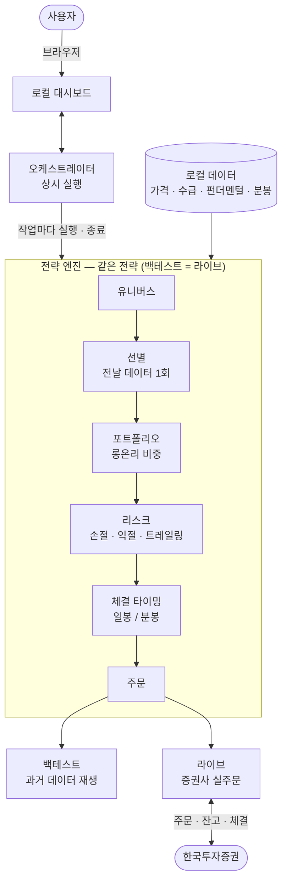

<div align="center">

# buylow

**한국 주식(KOSPI·KOSDAQ) 자동매매 전략을 코드 없이 구성하고, 과거 데이터로 백테스트하고, 실거래까지 돌리는 개인용 툴킷.**

[QuantConnect LEAN](https://github.com/QuantConnect/Lean) 엔진 위에서 동작하며, **동일한 전략 정의가 백테스트와 실거래에서 그대로 실행**됩니다. 모든 데이터·API 키는 내 PC에만 저장됩니다.

**한국어** · [English](./README.en.md) · [日本語](./README.ja.md)

[](https://github.com/JeongSeongMok/buylow/releases)
[](./LICENSE)
[](https://github.com/JeongSeongMok/buylow/stargazers)


<sub>한국 주식 자동매매 · 자동 트레이딩 봇 · 주식 백테스트 · 한국투자증권(KIS) API 자동매매 · LEAN · KOSPI · KOSDAQ · pykrx</sub>

<!-- 데모 스크린샷/GIF 자리: docs/assets/demo.png(또는 .gif) 추가 후 아래 한 줄 주석 해제

-->

</div>

---

## 목차

1. [개요](#개요)
2. [기능](#기능)
3. [지원 증권사](#지원-증권사)
4. [대시보드](#대시보드)
5. [아키텍처 및 파이프라인](#아키텍처-및-파이프라인)
6. [셋업](#셋업)
7. [면책 조항](#면책-조항)
8. [라이선스](#라이선스)

---

## 개요

buylow는 내 PC에서만 동작하는 **로컬 웹 대시보드**로 한국 주식 자동매매를 다룹니다. 설치 후 **브라우저 대시보드를 통해** 사용합니다.

- 코드를 짜지 않고 **지표(시그널) 조합 규칙 + 리스크 설정**으로 전략을 정의합니다.
- 한국시장 **전 종목 데이터**로 백테스트하고, 결과를 한국어 요약과 거래 내역으로 확인합니다.
- 같은 전략을 **한국투자증권(KIS) 실거래**로 그대로 돌립니다(백테스트=라이브 동형성).
- 데이터·API 키는 모두 로컬에만 저장되며 외부로 전송되지 않습니다.

---

## 기능

### 시그널 (알파) — 7종

각 시그널은 거래일마다 종목별로 **매수 우호 / 매도 우호 / 중립**을 판단합니다. 전략 설정 탭에서 파라미터를 조정합니다.

| 시그널 | 유형 | 설명 | 주요 파라미터 |
|---|---|---|---|
| EMA | 추세 | 단기 이평이 장기 이평 위면 매수 우호, 아래면 매도 우호 | 단기·장기 기간 |
| MACD | 추세·모멘텀 | MACD선이 시그널선 위면 매수 우호 | 단기·장기·시그널 |
| RSI | 과열·역추세 | 과매도면 매수 우호, 과매수면 매도 우호 | 기간·과매도·과매수 |
| 모멘텀 | 추세 | 최근 N일 수익률이 양수면 매수 우호 | 관측 기간 |
| 볼린저밴드 | 평균회귀·돌파 | 밴드 터치 시 평균회귀, 강하게 돌파하면 추세 추종으로 전환 | 기간·표준편차 배수·전환 임계(%) |
| 저평가(가치) | 펀더멘털 | 저PER·저PBR이면서 ROE(=PBR/PER)가 기준 이상이면 매수 우호(가치 함정 회피) | PER·PBR 상한·ROE·배당 하한 |
| 수급 추종 | 한국 시장 특화 | 외국인·기관·개인(선택) 최근 N일 누적 순매수가 양수면 매수 우호 | 누적 일수·투자자 선택 |

가치·수급 시그널은 펀더멘털·수급 데이터가 적재돼 있어야 동작합니다(아래 *데이터 관리* 참고).

### 매수 규칙

시그널을 불리언 규칙으로 조합합니다. 한 그룹 안의 조건은 모두 충족(**AND**), 그룹끼리는 하나만 충족(**OR**)하면 매수하며, **신호 보유 기간**(매수 신호가 사라진 뒤 며칠 더 보유할지)도 지정합니다. 전략은 하나만 저장됩니다(단일 전략).

구체적인 규칙 구성은 **대시보드의 전략 설정 탭**(조건 그룹 빌더)에서 합니다 — 아래 [대시보드](#대시보드) 참고.

### 리스크 관리

매수는 전략이, 매도는 신호 변화와 아래 리스크가 결정합니다(항목을 비우면 미적용).

- **종목 손절(%)** — 매수가 대비 N% 하락 시 매도
- **종목 익절(%)** — 평가이익 N% 도달 시 매도
- **트레일링 스탑(%)** — 매수 후 고점 대비 N% 하락 시 매도
- **롱온리(공매도 차단)** 및 **동시 보유 종목 상한**(과다하면 유동성 상위만 보유)이 기본 적용됩니다.

### 체결 타이밍 (2층 구조)

전략은 두 층으로 동작하며, **같은 코드가 백테스트와 라이브에서 동일하게** 실행됩니다.

- **① 선별** — **항상 전날 종가 데이터로 하루 1회** 매수/청산 대상을 고릅니다(장중 재선별 없음 → 과매매 방지).
- **② 체결 타이밍** — 그 대상을 *언제* 체결할지만 고릅니다. 고른 타이밍이 데이터 해상도를 자동 결정합니다.

| 타이밍 | 해상도 | 동작 |
|---|---|---|
| 시가 | 일봉 | 다음 거래일 **시가**에 체결 |
| 종가 | 일봉 | 다음 거래일 **종가**(MarketOnClose)에 체결 |
| 특정시각 | 분봉 | 지정한 시각에 전량 체결 |
| TWAP | 분봉 | 정규장(390분)을 N등분해 수량을 나눠 체결(시장충격 완화) |
| 눌림목 | 분봉 | 기준가 대비 눌리면 진입 / 반등하면 청산 |

- **리스크 평가도 종가 기준 하루 1회**입니다(선별과 같은 철학). 분봉 매분 손절은 장중 노이즈에 과매매를 일으켜 폐기했고, 청산 '판단'은 종가에, '체결'은 위 타이밍이 처리합니다.
- 분봉이 없는 종목/날짜는 **시가로 자동 폴백**합니다.
- ⚠️ 분봉 백테스트는 LEAN 데이터피드 한계로 **종목수 × 거래일 ≲ 10,000** 규모까지만 정확합니다(초과 시 사전 차단). 일봉·라이브는 무관합니다.

### 백테스트

- 기간 선택(날짜 선택기 + 1주·1달·3달·6달·1년 빠른 버튼), 초기자본 1억원 고정.
- 유니버스: 종목명·코드 검색, 인덱스 일괄추가(KOSPI200·KOSDAQ150), 전체 종목, 내 인덱스(그룹).
- 백그라운드 실행 + 진행률·로그, 실행 이력 보관(SQLite, 행별/전체 삭제).
- 결과 = 한국어 요약(총수익률·최종자산·최대낙폭·승률·샤프 등) + 거래 내역(날짜·종목·매수/매도·수량·금액·사유). 대량(수만 건) 거래도 페이지네이션으로 표시.

### 데이터 관리

데이터는 모두 **대시보드의 데이터 탭**에서 관리합니다.

- **데이터 최신화** 한 번으로 전 종목의 가격(OHLCV)·수급(투자자별 순매수)·펀더멘털(PER/PBR)을 증분 적재(비어 있으면 최근 5년 백필).
- **자동 적재 스케줄러**(기본 켜짐) — 서버 가동 중 일정 주기로 일봉을 증분 적재. 분봉 대상종목을 지정하면 함께 받습니다.
- **분봉 적재** — 종목/인덱스를 골라 분봉을 저장(이미 받은 날은 건너뜀). KIS는 분봉을 **최대 약 1년** 보관합니다.
- **적재 현황** — 종목명·코드 검색, 인덱스 필터, 종목 상세(가격·수급) 조회.
- **내 인덱스(커스텀 종목 그룹)** — 그룹 탭에서 원하는 종목을 묶어두면 백테스트·분봉적재·적재현황에서 KOSPI200처럼 `★이름`으로 한 번에 사용.

### 라이브 매매 (KIS)

- **매매 탭**에서 자동매매를 켜면, 저장한 전략 + 대상종목으로 실제 주문을 냅니다(끄면 멈춤).
- 매수는 전략·타이밍대로, 청산은 신호/리스크대로 — 백테스트와 같은 코드.
- **계좌 모니터링** — 예수금·매수가능·보유종목(매수가/현재가/손익), 장중/장마감 상태, 매매 내역(KIS 체결조회 기반, 10초마다 자동 갱신).
- **오늘의 선정** — 저장 전략·대상종목·현재 보유 기준으로 담을/뺄 종목을 미리 보여줍니다(전날 종가 1회 선별을 그대로 재현).
- 자동매매는 기본 **꺼짐**이며, 켜면 저장한 전략대로 바로 주문을 냅니다. 자세한 라이브 절차는 [docs/LIVE_KIS.md](./docs/LIVE_KIS.md) 참고.
- **운영 안정성** — 자동매매를 켜 두면 서버가 재시작돼도(배포·재부팅) 자동으로 재개되고, 라이브 프로세스가 예기치 않게 종료되면 잠시 후 자동으로 다시 시작합니다. 장 시작처럼 주문이 한꺼번에 몰릴 때도 증권사 초당 주문 한도에 맞춰 속도를 조절하고 일시적 오류는 재시도하므로, 주문 한 건의 실패가 전체 자동매매를 멈추지 않습니다.
- ⚠️ **라이브는 KIS 어댑터 DLL 빌드가 한 번 필요합니다**(Docker 설치는 이미지에 포함돼 자동; 직접 설치는 백테스트엔 불필요해 선택). 빌드 안 하고 토글을 켜면 *"KIS 어댑터가 없습니다"* 안내가 뜹니다 — 위 [설치](#설치)의 어댑터 빌드 단계를 실행하세요.

---

## 지원 증권사

| 증권사 | 데이터(시세·분봉) | 백테스트 | 라이브 실거래 | 상태 |
|---|:---:|:---:|:---:|---|
| **한국투자증권 (KIS 실전)** | ✅ | ✅ | ✅ | 동작 |
| **한국투자증권 (KIS 모의투자)** | ✅ | ✅ | ✅ (모의 서버) | 동작 — 실전 전 검증용 권장 |
| **토스증권** | — | — | — | 🚧 구현 예정 (Toss API 공개 대기) |

- KIS는 **실전과 모의투자의 앱키·계좌가 완전히 분리**돼 있어 각각 따로 등록·관리합니다(같은 로직, 환경만 다름).
- 매매(잔고·주문)는 고른 증권사 서버를 쓰고, **시세·분봉 적재는 모의를 골라도 항상 실전 도메인**에서 받습니다(계좌 불필요 조회라 더 안정적).
- 일봉 과거 데이터는 무인증 pykrx로 받으므로 증권사 선택과 무관합니다.

---

## 대시보드

| 탭 | 내용 |
|---|---|
| **전략 설정** (기본) | 시그널 파라미터, 매수 규칙(조건 그룹), 리스크, 체결 타이밍 |
| **백테스트** | 기간·유니버스 선택 후 실행, 결과·거래 내역 |
| **데이터** | 데이터 최신화, 적재 현황·검색·인덱스 필터, 분봉 적재, 자동 스케줄러 상태 |
| **그룹** | 내 인덱스(커스텀 종목 그룹) 생성·수정·삭제 |
| **설정** | 증권사 선택, KRX·증권사 API 키 입력(로컬 저장) |
| **작업중** | 백그라운드 작업 진행률·로그·실행 이력 |
| **● 매매** | 라이브 계좌 모니터링 + 자동매매 on/off + 대상종목 + 오늘의 선정 |

각 탭의 실제 화면은 **[대시보드 화면 모음 →](./SCREENSHOTS.md)** 에서 볼 수 있습니다.

---

## 아키텍처 및 파이프라인

상시 실행되는 **오케스트레이터**가 사용자의 요청(백테스트·라이브)을 받아 **전략 엔진을 작업마다 실행**하고 관리합니다. 모든 처리·데이터는 내 PC에서 이뤄지며, 같은 전략이 백테스트와 라이브에 동일하게 흐릅니다.



**핵심 설계**

- **전략을 한 번 작성하면 백테스트와 라이브에 동일하게 적용**됩니다(동형성).
- 선별(그날 담을/뺄 종목)은 전날 데이터로 하루 한 번, 체결은 고른 타이밍대로 — 두 층으로 분리됩니다.
- 매수는 전략이, 매도는 신호 변화와 리스크가 결정합니다.
- 모든 데이터·설정·이력은 사용자의 PC에만 저장됩니다.

---

## 셋업

### 설치

설치 방법은 두 가지입니다 — **Docker**(가장 간단, 모든 OS) 또는 **직접 설치**(Linux·macOS). 둘 다
백테스트·라이브를 한 번에 갖춥니다. Windows 사용자는 **Docker**를 권장합니다(직접 설치는 .NET·Python
런타임을 OS마다 손으로 맞춰야 해 번거롭습니다).

<details open>
<summary><b>① Docker (권장 — 모든 OS)</b></summary>

[Docker](https://docs.docker.com/get-docker/)만 있으면 됩니다(.NET·Python·LEAN은 이미지 안에 모두 포함).

```bash
git clone https://github.com/JeongSeongMok/buylow.git
cd buylow

# 빌드 + 백그라운드 기동 (첫 빌드는 .NET SDK·NuGet 받느라 수 분 걸립니다)
docker compose up -d --build
# 다른 포트로 열려면:  BUYLOW_PORT=9000 docker compose up -d --build

# 로그 보기 / 중지
docker compose logs -f
docker compose down
```

- 데이터·결과·설정은 호스트 디렉토리(`data/`, `runs/`, `state/`)에 저장돼 컨테이너를 지워도 **유지**됩니다
  — 설정(`config.local.yaml`)·실행 이력(`buylow.db`)·KIS 토큰은 `state/`에 모입니다.
- API 키는 **대시보드 설정 탭**에서 입력하며 `state/config.local.yaml`에 저장됩니다.
- 대시보드는 호스트의 `127.0.0.1`에만 매핑돼 **로컬 전용**입니다(외부 네트워크 노출 없음).
- 라이브용 KIS 어댑터 DLL이 이미지에 포함돼 있습니다.

</details>

<details>
<summary><b>② 직접 설치 (Linux · macOS)</b></summary>

**.NET 10 SDK**(엔진 실행) · **Python 3.11**(전략 실행) · **uv**(파이썬 환경) · **git**이 필요합니다.

```bash
# 1) .NET 10 SDK (영구 적용은 ~/.zshrc 또는 ~/.bashrc 에 export 추가)
curl -fsSL https://dot.net/v1/dotnet-install.sh | bash -s -- --channel 10.0 --install-dir "$HOME/.dotnet"
export DOTNET_ROOT="$HOME/.dotnet" && export PATH="$HOME/.dotnet:$PATH"

# 2) Python 3.11 · git   (macOS: brew / Debian·Ubuntu: apt)
brew install python@3.11 git                              # macOS
# sudo apt install -y python3.11 python3.11-venv git      # Linux(Debian·Ubuntu)
curl -LsSf https://astral.sh/uv/install.sh | sh           # uv

# 3) 코드 + 의존성
git clone https://github.com/JeongSeongMok/buylow.git
cd buylow
uv venv .venv && uv pip install --python .venv/bin/python -e ".[dev]"

# 4) 대시보드 실행 (기본 포트 8420)
.venv/bin/python -m orchestrator.api
# 다른 포트로 열려면:  BUYLOW_DASHBOARD_PORT=9000 .venv/bin/python -m orchestrator.api

# 5) (라이브 실거래용 — 백테스트만 쓰면 생략) KIS 어댑터 빌드
dotnet build launcher/BuylowLauncher.csproj -c Release   # 런처 먼저(NuGet 복원)
scripts/build-adapter.sh                                  # 어댑터 빌드 + DLL을 런처 옆에 복사
```

</details>

실행하면 브라우저에서 대시보드(기본 `http://127.0.0.1:8420`, 위에서 바꾼 포트가 있으면 그 포트)에 접속합니다.

### 키 설정

키는 **대시보드 설정 탭**에서 입력·관리합니다(로컬에만 저장).

- **KRX 아이디·비밀번호** — 수급·펀더멘털 데이터용([무료 가입](https://data.krx.co.kr)). 가격만 쓰면 불필요.
- **증권사(KIS) 키** — 설정 탭에서 증권사(실전/모의)를 고른 뒤 App Key·App Secret·계좌번호·HTS ID를 입력합니다(실전/모의 각각 분리, HTS ID는 라이브 체결통보에 필요).

---

## 면책 조항

이 소프트웨어는 교육 목적으로 제공됩니다. 자동 매매는 상당한 금융 리스크를 수반하며, 사용에 따른 책임은 전적으로 사용자에게 있습니다. 제작자는 어떠한 금전적 손실에도 책임지지 않습니다. 사용 시 증권사 API 약관 및 관련 법규를 반드시 준수하십시오. 백테스트 결과는 과거 데이터 기반 추정이며 미래 수익을 보장하지 않습니다. 특히 라이브 자동매매는 토글을 켜는 즉시 실제 주문이 전송되므로, 반드시 모의투자로 충분히 검증한 뒤 소액으로 시작하십시오.

---

## 라이선스

[MIT License](./LICENSE) © buylow contributors
