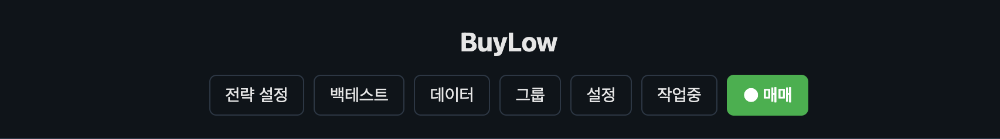
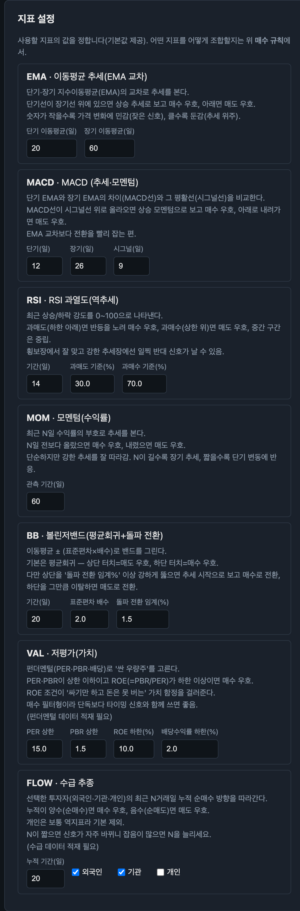
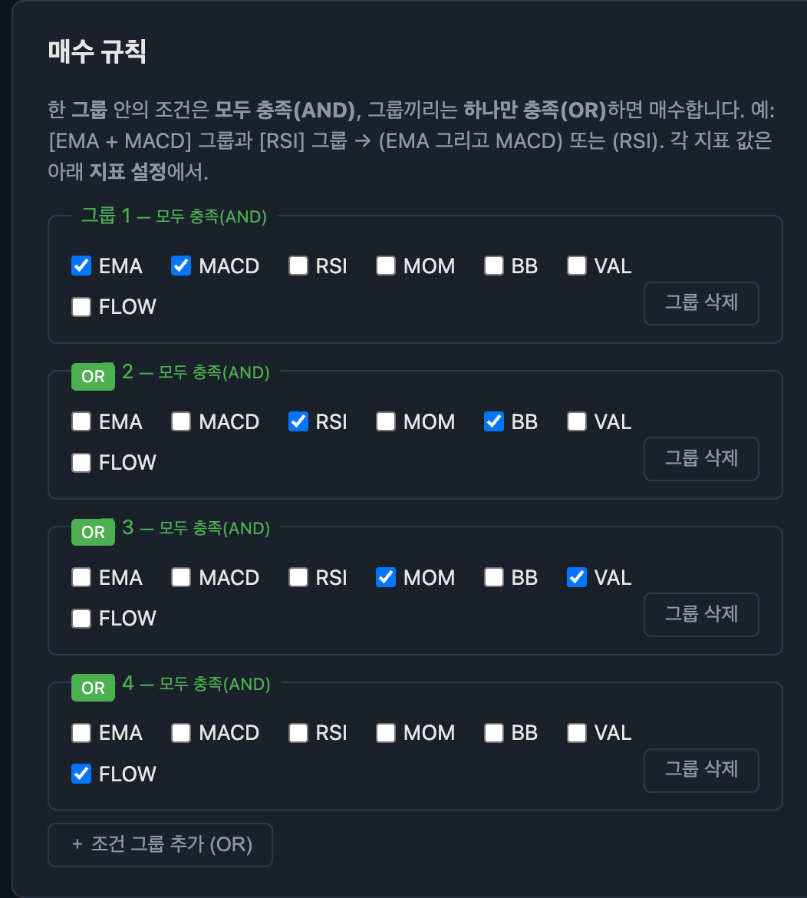
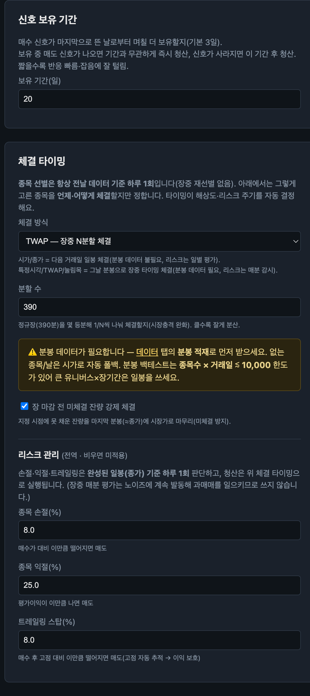
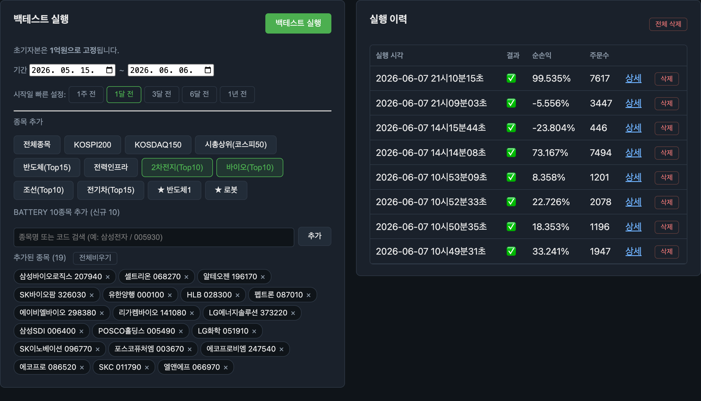
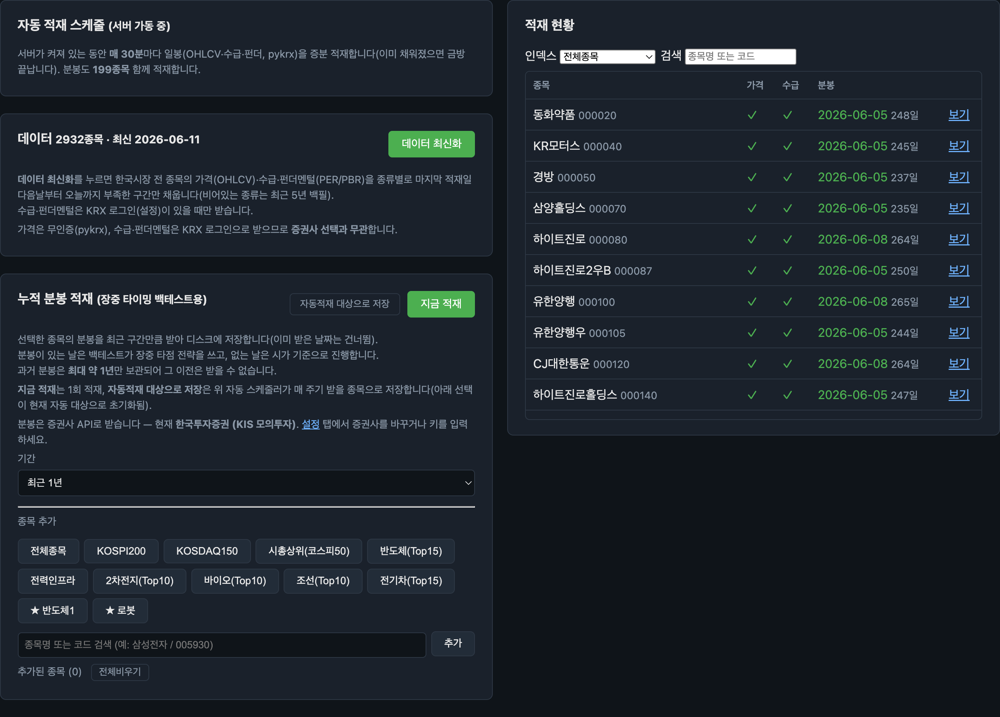
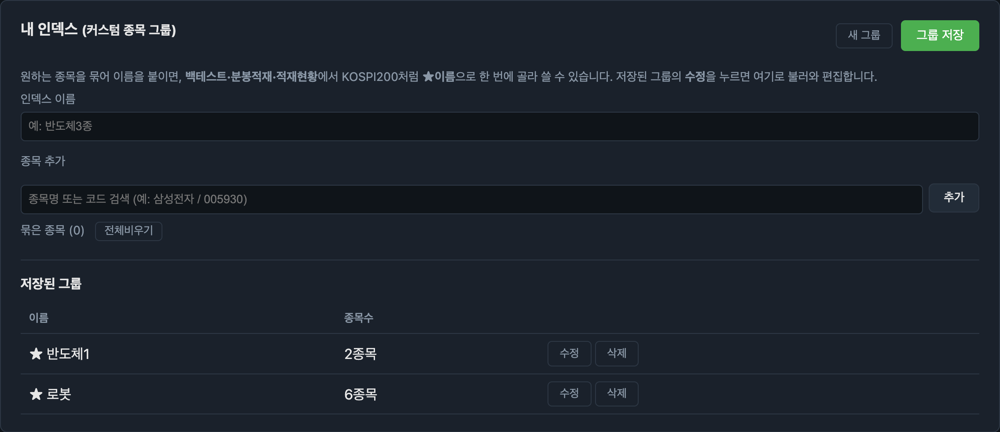
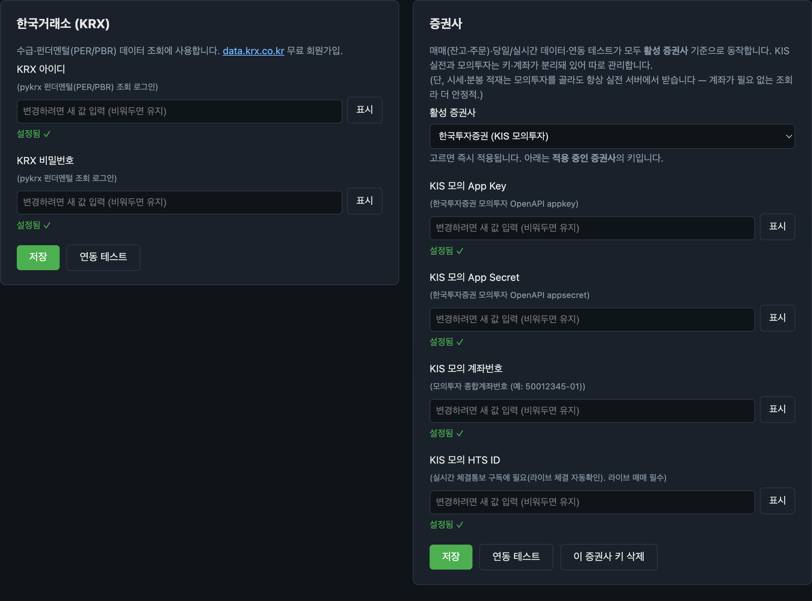
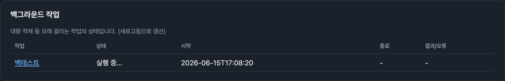
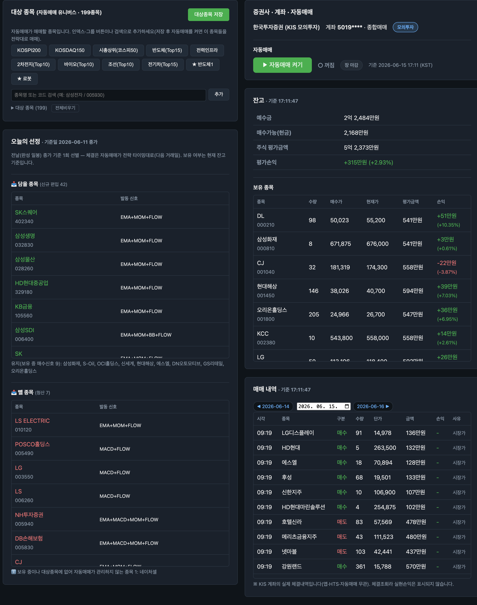

# buylow 대시보드 화면 모음

실제 동작 화면입니다. 전체 개요는 [README](./README.md), 탭 설명은 [README의 대시보드 절](./README.md#대시보드)을 참고하세요.

> 모든 화면은 내 PC의 로컬 브라우저(`127.0.0.1`)에서만 열리며, 데이터·API 키는 외부로 전송되지 않습니다.

---

## 탭 내비게이션

상단 탭으로 전략 설정·백테스트·데이터·그룹·설정·작업중·매매를 오갑니다. 현재 보고 있는 탭이 강조됩니다(실거래 진입점인 **매매**는 항상 강조색).

---

## 전략 설정 탭

코드 없이 **지표(시그널) 파라미터 → 매수 규칙(조건 그룹) → 신호 보유 기간 → 체결 타이밍 → 리스크**를 한 화면에서 정의합니다(단일 전략 저장). 실제 대시보드처럼 2컬럼으로 배치했습니다.

<table>
<tr>
<td width="50%" valign="top">

**지표 설정 — 7종 시그널 파라미터**

EMA·MACD·RSI·모멘텀·볼린저밴드·저평가(가치)·수급 추종 각각의 기간·임계값을 조정합니다.

</td>
<td width="50%" valign="top">

**매수 규칙 — 조건 그룹 빌더**

한 그룹 안의 지표는 모두 충족(**AND**), 그룹끼리는 하나만 충족(**OR**)하면 매수합니다. 예: `[EMA + MACD]` 또는 `[RSI + BB]` 또는 `[MOM + VAL]` 또는 `[FLOW]`.

**신호 보유 기간 · 체결 타이밍 · 리스크**

매수 신호가 사라진 뒤 며칠 더 보유할지, 그리고 선별된 종목을 *언제* 체결할지(시가/종가/지정시각/TWAP/눌림목)를 고릅니다. 타이밍이 데이터 해상도(일봉/분봉)와 리스크 평가 주기를 자동 결정합니다. 손절·익절·트레일링 스탑도 여기서 설정합니다.

</td>
</tr>
</table>

---

## 백테스트 탭

### 실행 — 기간·유니버스 선택

기간(빠른 선택 1주~1년)과 종목(전체·KOSPI200·KOSDAQ150·내 그룹·검색)을 고르고 실행합니다. 오른쪽에 실행 이력(순손익·주문수)이 쌓이며 상세/삭제할 수 있습니다.

### 진행 로그 — 실시간

백그라운드 잡으로 돌아가는 LEAN 엔진의 진행 로그를 실시간으로 봅니다.

### 결과 — 한국어 요약 · 신호 진단 · 거래 내역

수익률·MDD·승률·샤프 등을 한국어(억/만원)로 요약하고, 매수 신호를 주로 발동시킨 시그널을 진단하며, 날짜·종목·구분·수량·금액·사유가 담긴 거래 내역을 페이지네이션으로 봅니다.

---

## 데이터 탭

데이터 최신화(전 종목 증분 적재), 적재 현황(가격·수급 적재 여부와 최신 일자)·검색·인덱스 필터, 분봉 적재, 그리고 자동 스케줄러 상태를 다룹니다.

---

## 그룹 탭

원하는 종목을 묶어 **내 인덱스(커스텀 종목 그룹)**를 만들면, 백테스트·분봉적재·적재현황·매매에서 KOSPI200처럼 `★이름`으로 한 번에 골라 쓸 수 있습니다(생성·수정·삭제).

---

## 설정 탭

증권사(KIS 실전/모의)를 고르고, KRX(pykrx) 로그인과 증권사 API 키(App Key·Secret·계좌번호·HTS ID)를 입력합니다. 모든 키는 로컬에만 저장됩니다.

---

## 작업중 탭

대량 적재·백테스트 등 오래 걸리는 백그라운드 작업의 상태(실행 중/종료·시작 시각·결과)를 봅니다.

---

## 매매 탭 (라이브)

전체 2컬럼 구성입니다.

- **왼쪽** — 자동매매 대상 종목(라이브 유니버스) 선택 + **오늘의 선정**(전략·대상종목·현재 보유 기준으로 담을/뺄 종목 미리보기, LEAN 없이 전날 종가 1회로 재현).
- **오른쪽** — 증권사·계좌·**자동매매 on/off**(+장 상태 배지)를 한 카드에, 그 아래 **잔고/보유 종목**(KIS 잔고조회, 앱 매수도 반영)과 **매매 내역**(KIS 실제 체결, 날짜 이동).

잔고·매매내역은 백그라운드로 캐시돼 10초마다 자동 갱신됩니다.

